# Semi-2005

  

## About Me

Hi, I’m **Semi** — a computer engineering student and full stack developer passionate about building modern web apps and machine learning projects.

## What I Do

- Computer Engineering
- Full Stack Development
- Machine Learning
- Java Development

## Tech Stack

- Java
- Python
- React
- FastAPI
- Spring
- Machine Learning
- Git
- GitHub
- Docker

## Current Focus

Building **spam-message-collector** ML app.

## Contact

- Portfolio: [github.com/semikzr](https://github.com/semikzr)
- Email: semi@example.com

  

